# Carefree Meditation App

### Meditation app for listening to audio and taking courses with audio. Save courses and audio, a mood board for every day.

## Includes
- Swift
- SwiftUI
- clean MVVM architecture
- AVKit
- Combine Framework
- Firebase Auth + Database + Storage
- Custom view and components
- Animations

## Gif

## Scrinshots

- OnBoard, Login Screens

  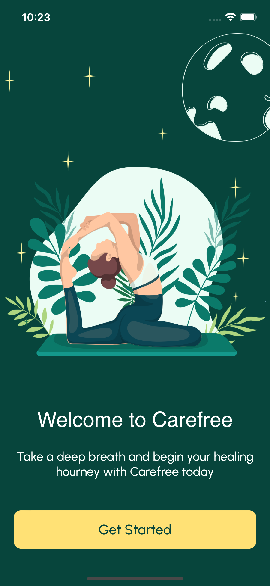
 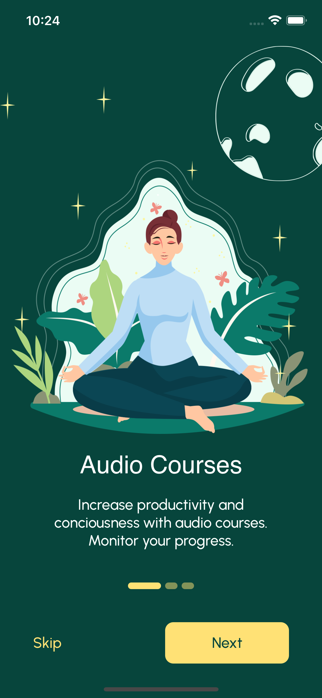
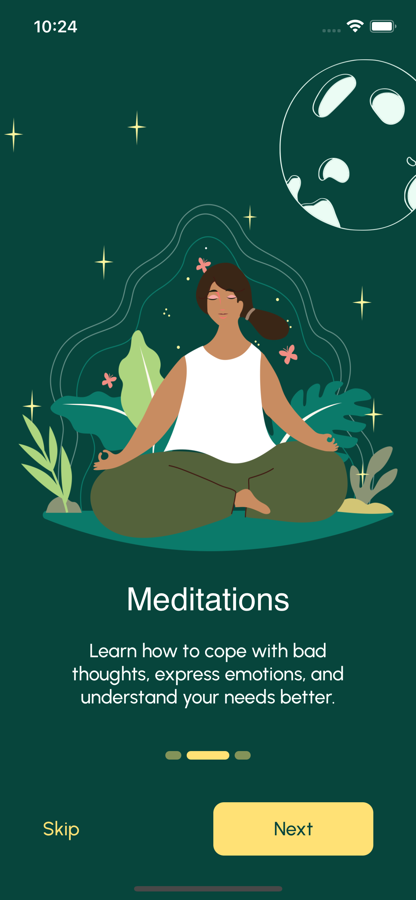
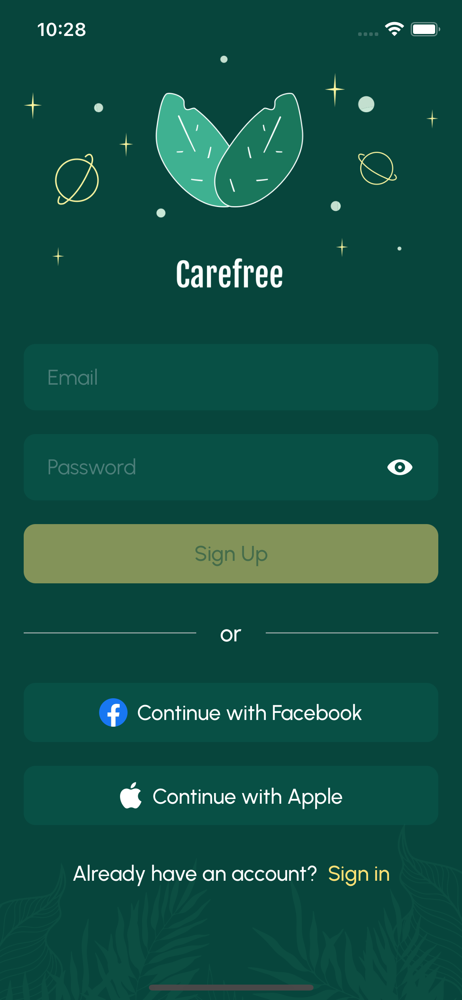
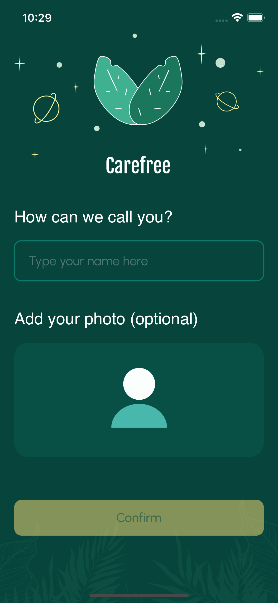
  

  
- Main screen
 

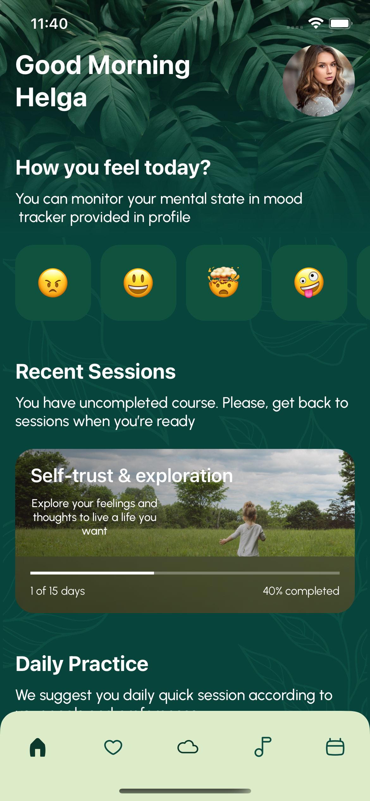
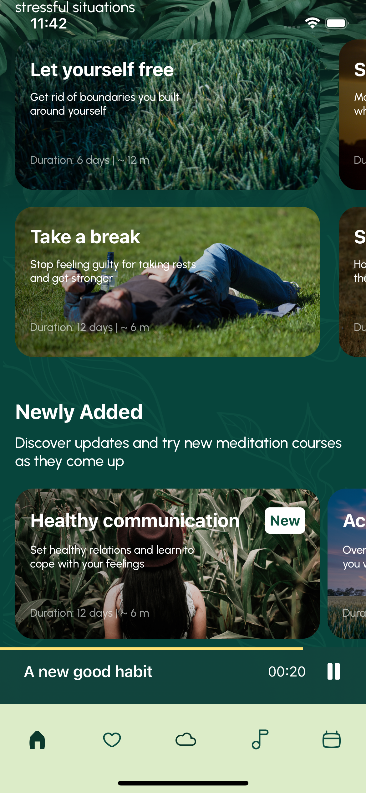
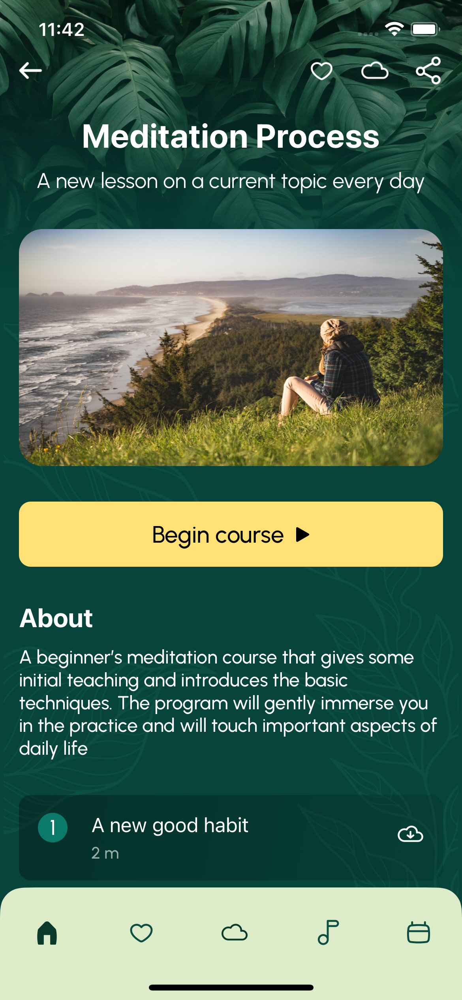
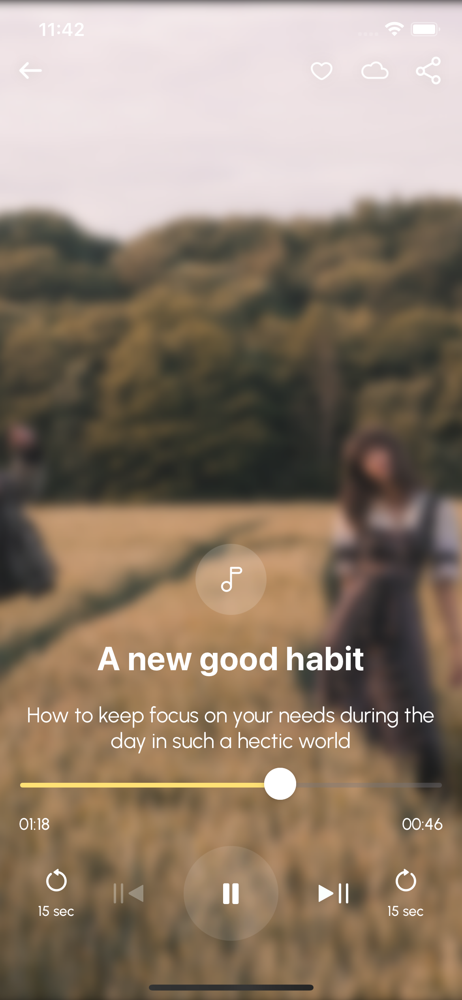
   

- Favourite, Profile screens
 

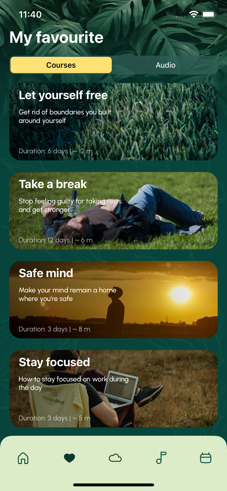
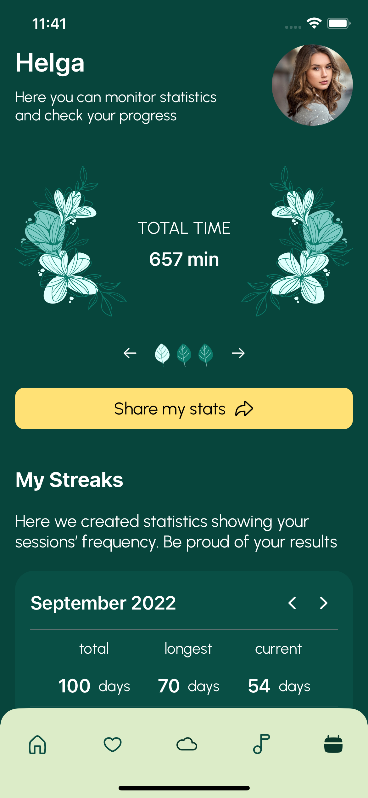
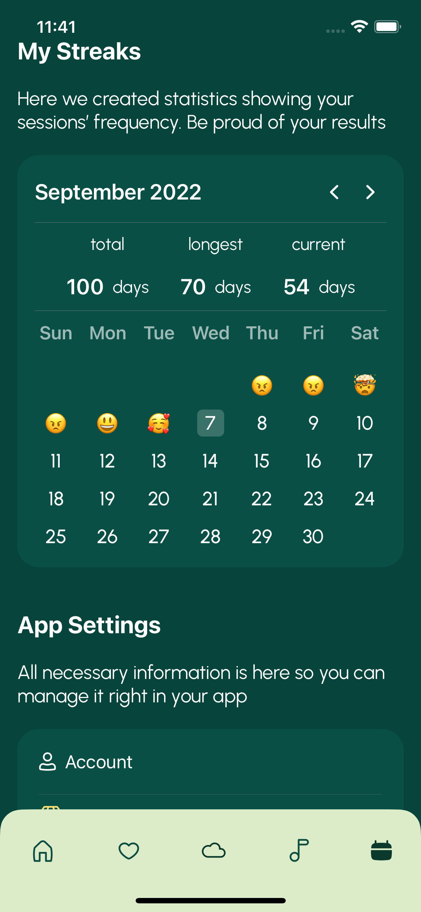

## Author
* [Bogdan Zykov](https://github.com/BogdanZyk)

## Designer
* [Angelika](https://dribbble.com/straigntline_ang)

## License

 Copyright 2022 Bogdan Zykov.
 Licensed under MIT License: https://opensource.org/licenses/MIT
